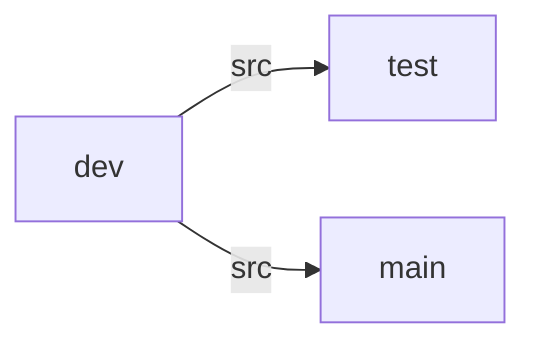

# Branch Architecture

`dev`

- write source code

- trace files to be submitted, .gitignore

`test`

- verify source code

- store files not to be sumitted, like test code, symlinc to docs, README.md

`main`

- branch to be submitted

- merge dev after verifying, remove .gitignore, submit

